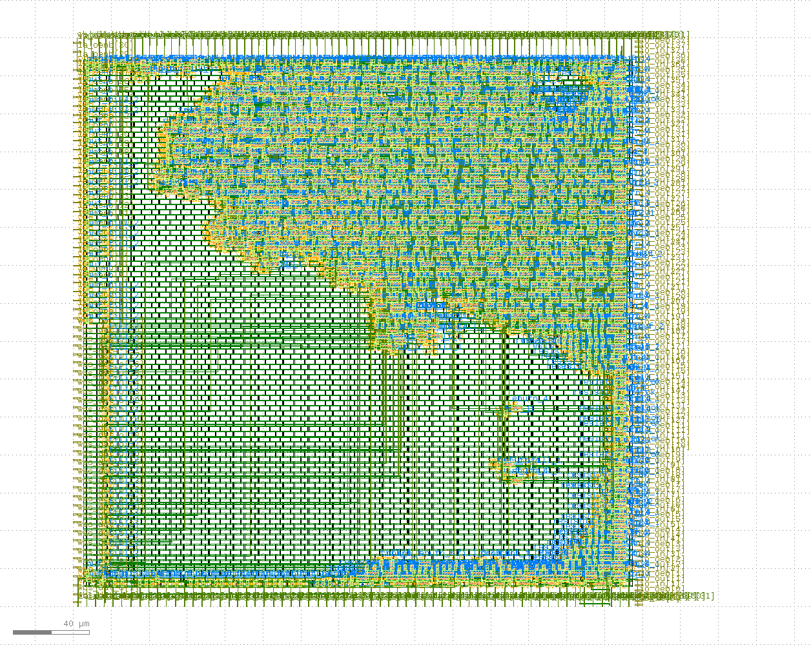
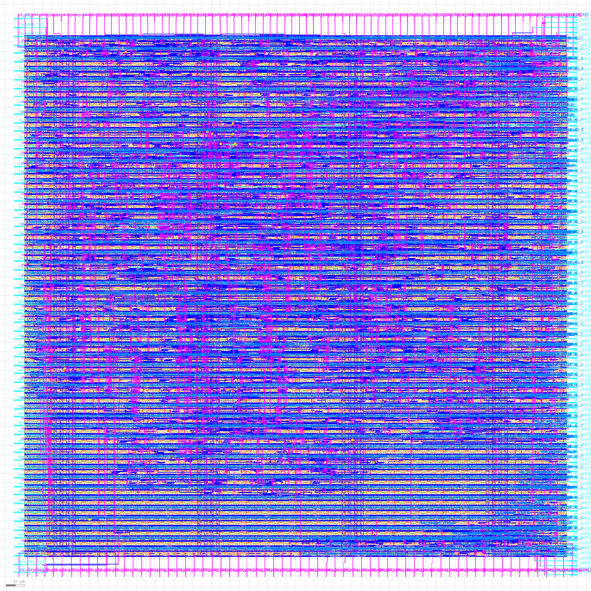
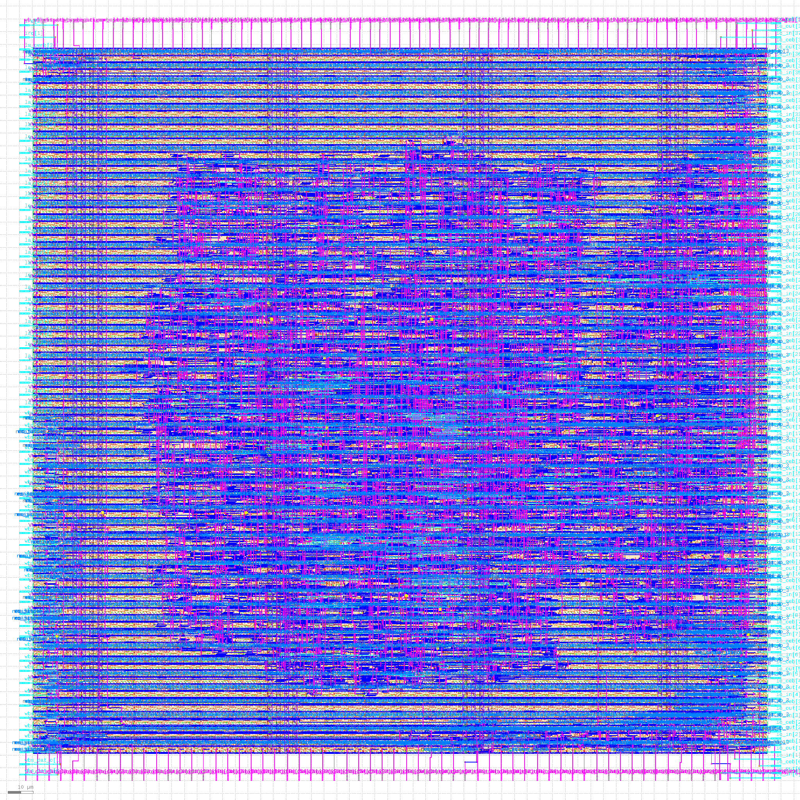
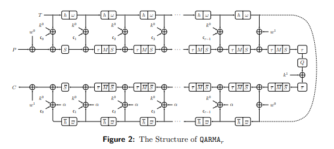
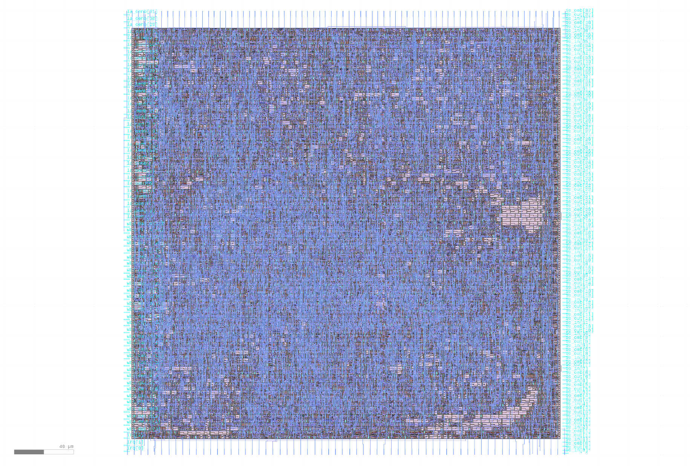
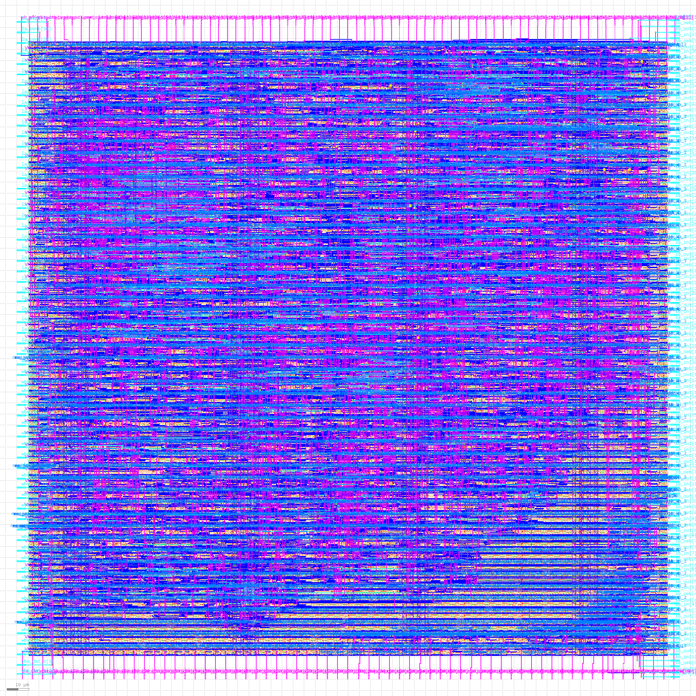
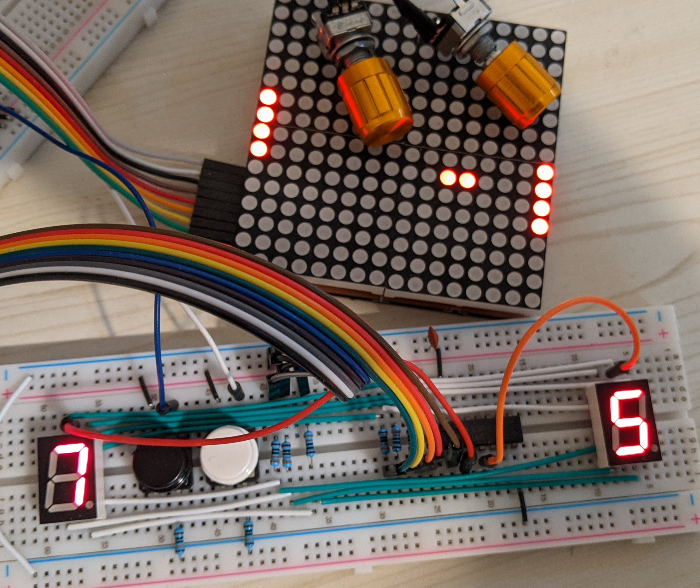
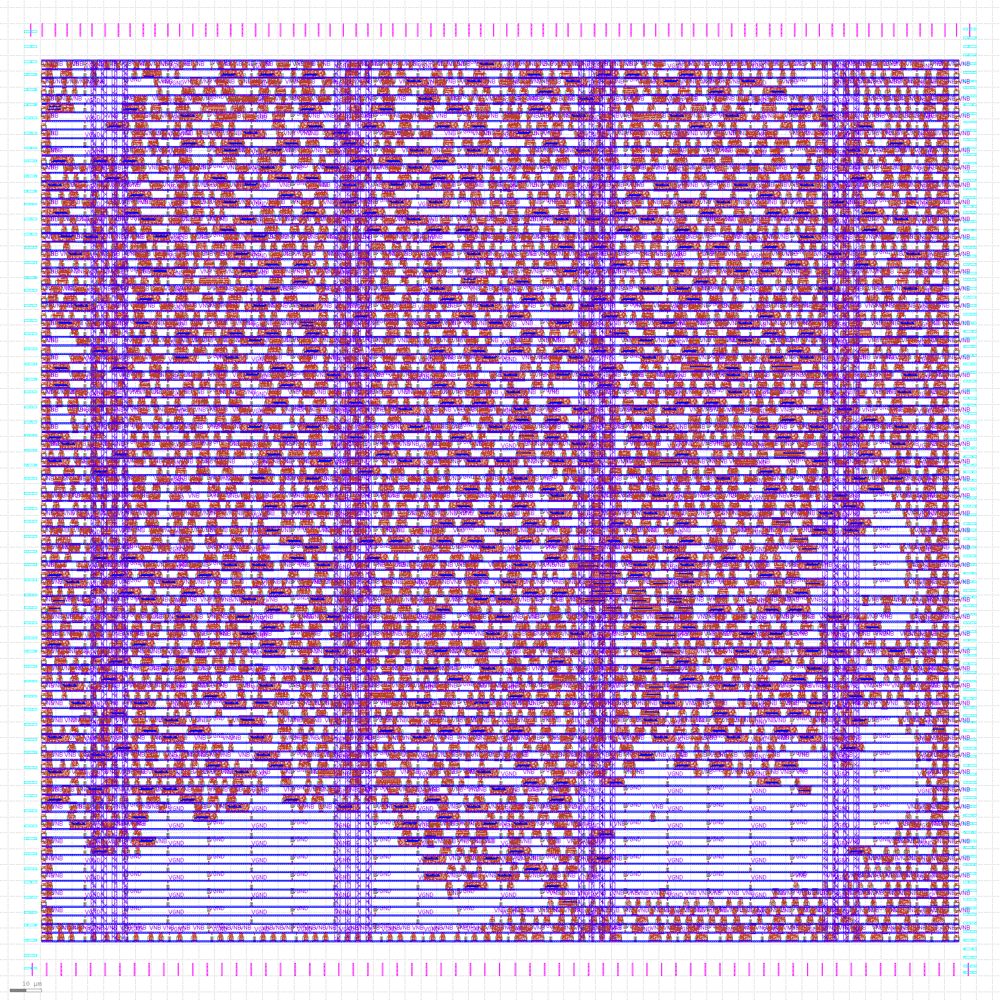

# Caravel User Project

  

---

# Multi Project Index

This index was made with [multi project tools](https://github.com/mattvenn/multi_project_tools) at commit d1defefbe093b2b029b623f4aaf5cbe9fb362412

The OpenLANE config was generated with this command:

    ./multi_tool.py --create-openlane-config --copy-gds  --force-delete

Using this [configuration](projects.yaml)

## RGB Mixer

* Author: Matt Venn
* Github: [https://github.com/mattvenn/wrapped_rgb_mixer/tree/caravel-mpw-two-c](https://github.com/mattvenn/wrapped_rgb_mixer/tree/caravel-mpw-two-c)
* commit: 19a96ea
* Description: reads 3 encoders and generates PWM signals to drive an RGB LED

## Frequency counter

* Author: Matt Venn
* Github: [https://github.com/mattvenn/wrapped_frequency_counter/tree/caravel-mpw-two-c](https://github.com/mattvenn/wrapped_frequency_counter/tree/caravel-mpw-two-c)
* commit: c4aefe6
* Description: Counts pulses on input and displays frequency on 2  seven segment displays

## A5/1 Wishbone

* Author: Jamie Iles
* Github: [https://github.com/jamieiles/a5-1-wb-macro](https://github.com/jamieiles/a5-1-wb-macro)
* commit: 0528740
* Description: A5/1 cryto block connected via wishbone to PicoRV32

## Fibonacci

* Author: Konrad Rzeszutek Wilk
* Github: [https://github.com/konradwilk/fibonacci](https://github.com/konradwilk/fibonacci)
* commit: 3dcdd1b
* Description: Fibonacci emitter connected to [37:8] and controlled via wishbone

## Quad PWM FET Drivers

* Author: Chris DePalm
* Github: [https://github.com/ChrisDePalm/wrapped_quad_pwm_fet_drivers.git](https://github.com/ChrisDePalm/wrapped_quad_pwm_fet_drivers.git)
* commit: 547d9e1
* Description: 4 PWM FET Drivers for Power Applications

## memLCDdriver

* Author: Matt Beach
* Github: [https://github.com/matt-beach/wrapped_memLCDdriver.git](https://github.com/matt-beach/wrapped_memLCDdriver.git)
* commit: 07e07f9
* Description: SPI to 64-color memory LCD interface

## QARMA-64 Accelerator

* Author: Viktor H. Brange
* Github: [https://github.com/vbrange/verilog_qarma](https://github.com/vbrange/verilog_qarma)
* commit: 8a10211
* Description: Implementation of QARMA 64

## ChaCha20 Accelerator

* Author: Richard Petri
* Github: [https://github.com/rpls/wrapped_chacha_wb_accel](https://github.com/rpls/wrapped_chacha_wb_accel)
* commit: a312d9d
* Description: A minimal Wishbone connected ChaCha20 accelerator

## Framebufferless Video Core

* Author: Tom Gwozdz
* Github: [https://github.com/tomgwozdz/fbless-graphics-core](https://github.com/tomgwozdz/fbless-graphics-core)
* commit: fdd7f04
* Description: A framebufferless VGA video generator, under CPU control

## Pong

* Author: Erik van Zijst
* Github: [https://github.com/erikvanzijst/wrapped_pong.git](https://github.com/erikvanzijst/wrapped_pong.git)
* commit: 8506f61
* Description: A hardware implementation of Pong

## Hack soc

* Author: Maximo Balestrini
* Github: [https://github.com/mbalestrini/wrapped_hack_soc](https://github.com/mbalestrini/wrapped_hack_soc)
* commit: 416d3ec
* Description: Hardware implementation of the Hack Computer from the Nand to Tetris courses

## gfxdemo

* Author: Konrad Beckmann
* Github: [https://github.com/kbeckmann/wrapped_gfxdemo](https://github.com/kbeckmann/wrapped_gfxdemo)
* commit: 432874a
* Description: gfxdemo

## Wishbone HyperRAM

* Author: Pawel Sitarz
* Github: [https://github.com/embelon/wrapped_wb_hyperram](https://github.com/embelon/wrapped_wb_hyperram)
* commit: 5e793ea
* Description: Simple HyperRAM driver accesible on Wishbone bus

## Newmot SoC

* Author: Charles-Henri Mousset
* Github: [https://github.com/chmousset/caravel_multi_newmot](https://github.com/chmousset/caravel_multi_newmot)
* commit: e34a612
* Description: Simple SoC dmonstrating a Stepper Motor step/dir generator, and litex wishbone / uart / pwm

## hoggephase

* Author: David Hulton
* Github: [https://github.com/h1kari/wrapped_hoggephase_project](https://github.com/h1kari/wrapped_hoggephase_project)
* commit: 3dbdd48
* Description: Hogge Phase EMFI/BBI Glitch Detector

## bfloat16_fma

* Author: Author
* Github: [https://github.com/etalian/mensa](https://github.com/etalian/mensa)
* commit: 2b61fe3
* Description: dual bfloat16 fused multiply-add

