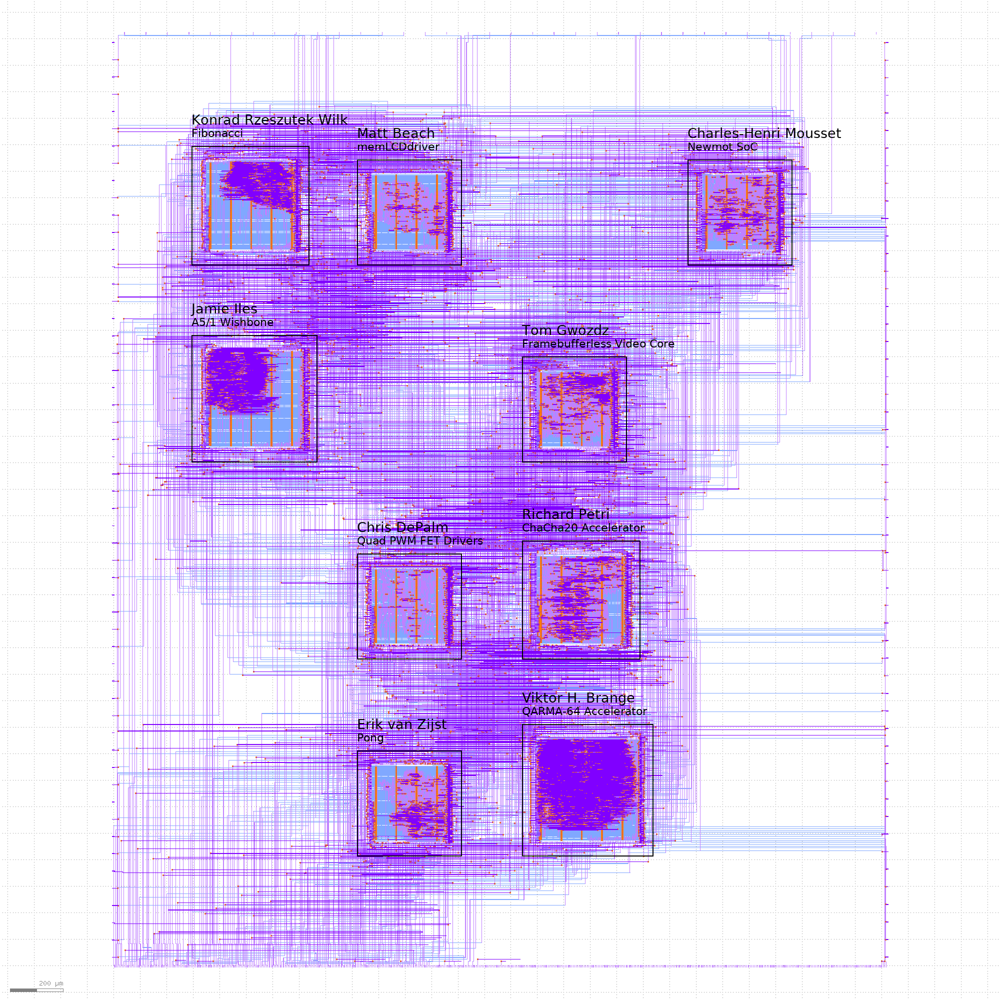

# Caravel User Project

---

# Multi Project Index

This index was made with [multi project tools](https://github.com/mattvenn/multi_project_tools) at commit 9589f7f233261ebe0da068303e377f373b0068d0

The OpenLANE config was generated with this command:

    ./multi_tool.py --create-openlane-config --copy-gds  --force-delete

## A5/1 Wishbone

* Author: Jamie Iles
* Github: https://github.com/jamieiles/a5-1-wb-macro
* commit: 70fd725d4ee73b60ac5915f57b364931bb2d57ce
* Description: A5/1 cryto block connected via wishbone to PicoRV32

## Fibonacci

* Author: Konrad Rzeszutek Wilk
* Github: https://github.com/konradwilk/fibonacci
* commit: 9a6416b9ed78bdbb10b3c4b55adac8ea9ae0e9d5
* Description: Fibonacci emitter connected to [37:8] and controlled via wishbone

## Quad PWM FET Drivers

* Author: Chris DePalm
* Github: https://github.com/ChrisDePalm/wrapped_quad_pwm_fet_drivers
* commit: ddcb6f1e6cf6afa01c3a0783a6d0ee861a67b3c2
* Description: 4 PWM FET Drivers for Power Applications

## memLCDdriver

* Author: Matt Beach
* Github: https://github.com/matt-beach/wrapped_memLCDdriver
* commit: 43489a15d43f18dfcf133afba92e90cea578adad
* Description: SPI to 64-color memory LCD interface

## QARMA-64 Accelerator

* Author: Viktor H. Brange
* Github: https://github.com/vbrange/wrapped_qarma
* commit: 35bad4464e4bcc45bb1cbfa9cb308338195268fe
* Description: Implementation of QARMA 64

## ChaCha20 Accelerator

* Author: Richard Petri
* Github: https://github.com/rpls/wrapped_chacha_wb_accel
* commit: 99044467b06d30a590c90134bbcf446e411e570a
* Description: A minimal Wishbone connected ChaCha20 accelerator

## Framebufferless Video Core

* Author: Tom Gwozdz
* Github: https://github.com/tomgwozdz/wrapped-fbless-graphics-core
* commit: 7297133c9f7aaf617fa59591dacb3c80ded45667
* Description: A framebufferless VGA video generator, under CPU control

## Pong

* Author: Erik van Zijst
* Github: https://github.com/erikvanzijst/wrapped_pong
* commit: 41cdd8cad3c281c723b64981803295b8960bab01
* Description: A hardware implementation of Pong

## Newmot SoC

* Author: Charles-Henri Mousset
* Github: https://github.com/chmousset/caravel_multi_newmot
* commit: 031ba67a6c9d9b16c6ed732da0feb53d8f4d1424
* Description: Simple SoC dmonstrating a Stepper Motor step/dir generator, and litex wishbone / uart / pwm

